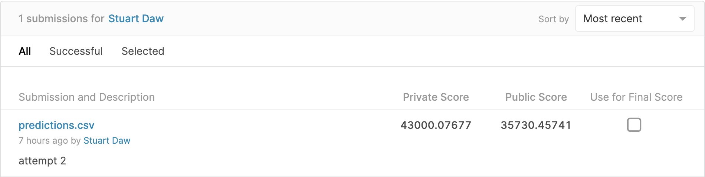

# Project 2 - Ames Housing Data and Kaggle Challenge

## Problem Statement

1. IDEAL
The ideal scenario is that the regression model I produce will be able to accurately predict the house price of previously unseen houses with only their features provided. This could be used for investors, estate agents and house sellers to allow for better decision making. It will also allow these stakeholders to make understand what drives prices. Different things will be able to be inferred. It could range from advice on home improvements to potential investment opportunities.

2. REALITY
I have the Ames housing data which has to be cleaned, organised and improved to enable me to tune my model. The data in its current state will not provide a very useful model. 

3. CONSEQUENCES
Without cleaning the data and tuning the model the users wont be able to predict the house prices very accurately. This means that my stakeholders wont be able to have the information they require to make good decisions.

4. PROPOSAL
My proposal is to start by cleaning the data and discover features that have a good correlation to the sales price. I will start by creating a baseline then start modelling with features and see if the baseline can be improved. As I refine and create features these iterations will continuosly improve the model. Success will be an accurate model and wone I can deduce key features and infer some valuable insights for my stakeholders. I will use Linear regression with ridge, lasso and elasticnet regularisation.

N.b. Kaggle Score will be a measure of accuracy of the model

## Executive Summary

There are some key features in predicting house prices that can give buyers and sellers some important strategies for getting the best house price.

It is hard to know what is important in deciding how much a property is worth and how much investment should be made to increase its current value. If you dont know what these drivers are then expensive mistakes could be made or bargains could be missed.

I have developed a model to predict house prices in the Ames area. It can predict the price given the houses attributes. It has also been used to infer some key features which are important. These include living area, overall quality and key locations. Basements are also important in Ames. However the shape of the property and other external features can affect the price in a negative way.

The model was tested on Kaggle and had an RMSE Score of 35,730. Read more to gain further insights into the Ames housing market.

### Contents:

- [Data Dictionary](#Data-Dictionary)
- [Data Collection](#Data-Collection)
- [Visualising and Relationships in the data](#Visualising-and-Relationships-in-the-data)
- [Key Outside Research Summary](#Key-Outside-Research-Summary)
- [Recommendations](#Recommendations)
- [References](#References)

## Data Dictionary

|Feature|Type|Dataset|Description|
|---|---|---|---|
| id | int | train | Property number |
| pid | int | train | Row number |
| ms_subclass | int | train | The building class |
| ms_zoning | string | train | Identifies the general zoning classification of the sale. |
| lot_frontage | float | train | Linear feet of street connected to property |
| lot_area | int | train | Lot size in square feet |
| street | string | train | Type of road access to property |
| alley | string | train | Type of alley access to property |
| lot_shape | string | train | General shape of property |
| land_contour | string | train | Flatness of the property |
| utilities | string | train | Type of utilities available |
| lot_config | string | train | Lot configuration |
| land_slope | string | train | Slope of property |
| neighborhood | string | train | Physical locations within Ames city limits |
| condition_1 | string | train | Proximity to main road or railroad |
| condition_2 | string | train | Proximity to main road or railroad (if a second is present) |
| bldg_type | string | train | Type of dwelling |
| house_style | string | train | Style of dwelling |
| overall_qual | int | train | Overall material and finish quality |
| overall_cond | int | train | Overall condition rating |
| year_built | int | train | Original construction date |
| year_remod/add | int | train | Remodel date (same as construction date if no remodeling or additions) |
| roof_style | string | train | Type of roof |
| roof_matl | string | train | Roof material |
| exterior_1st | string | train | Exterior covering on house |
| exterior_2nd | string | train | Exterior covering on house (if more than one material) |
| mas_vnr_type | string | train | Masonry veneer type |
| mas_vnr_area | float | train | Masonry veneer area in square feet |
| exter_qual | string | train | Exterior material quality |
| exter_cond | string | train | Present condition of the material on the exterior |
| foundation | string | train | Type of foundation |
| bsmt_qual | string | train | Height of the basement |
| bsmt_cond | string | train | General condition of the basement |
| bsmt_exposure | string | train | Walkout or garden level basement walls |
| bsmtfin_type_1 | string | train | Quality of basement finished area |
| bsmtfin_sf_1 | float | train | Type 1 finished square feet |
| bsmtfin_type_2 | string | train | Quality of second finished area (if present) |
| bsmtfin_sf_2 | float | train | Type 2 finished square feet |
| bsmt_unf_sf | float | train | Unfinished square feet of basement area |
| total_bsmt_sf | float | train | Total square feet of basement area |
| heating | string | train | Type of heating |
| heating_qc | string | train | Heating quality and condition |
| central_air | string | train | Central air conditioning |
| electrical | string | train | Electrical system |
| 1st_flr_sf | int | train | First Floor square feet |
| 2nd_flr_sf | int | train | Second floor square feet |
| low_qual_fin_sf | int | train | Low quality finished square feet (all floors) |
| gr_liv_area | int | train | Above grade (ground) living area square feet |
| bsmt_full_bath | float | train | Basement full bathrooms |
| bsmt_half_bath | float | train | Basement half bathrooms |
| full_bath | int | train | Full bathrooms above grade |
| half_bath | int | train | Half baths above grade |
| bedroom_abvgr | int | train | Number of bedrooms above basement level |
| kitchen_abvgr | int | train | Number of kitchens |
| kitchen_qual | string | train | Kitchen quality |
| totrms_abvgrd | int | train | Total rooms above grade (does not include bathrooms) |
| functional | string | train | Home functionality rating |
| fireplaces | int | train | Number of fireplaces |
| fireplace_qu | string | train | Fireplace quality |
| garage_type | string | train | Garage location |
| garage_yr_blt | float | train | Year garage was built |
| garage_finish | string | train | Interior finish of the garage |
| garage_cars | float | train | Size of garage in car capacity |
| garage_area | float | train | Size of garage in square feet |
| garage_qual | string | train | Garage quality |
| garage_cond | string | train | Garage condition |
| paved_drive | string | train | Paved driveway |
| wood_deck_sf | int | train | Wood deck area in square feet |
| open_porch_sf | int | train | Open porch area in square feet |
| enclosed_porch | int | train | Enclosed porch area in square feet |
| 3ssn_porch | int | train | Three season porch area in square feet |
| screen_porch | int | train | Screen porch area in square feet |
| pool_area | int | train | Pool area in square feet |
| pool_qc | string | train | Pool quality |
| fence | string | train | Fence quality |
| misc_feature | string | train | Miscellaneous feature not covered in other categories |
| misc_val | int | train | $Value of miscellaneous feature |
| mo_sold | int | train | Month Sold |
| yr_sold | int | train | Year Sold |
| sale_type | string | train | Type of sale |
| saleprice | int | train | Price property was sold for |

## Data Collection

Data collection was challenging due to the large amounts os missing data. I tried to impute where possible. I used a range of techniques such as using averages, predicting with SLR and using 0 to remove any weighting.

I also used the original Kaggle data to check any outliers.

## Visualising and Relationships in the data

The work book contains many visualisations. The following box plot shows some of the key relationships with sales price.

## Key Outside Research Summary

There were several key areas of research that I did. I wanted to check if my dataset was missing nay major pieces. I found that these 8 factors contribute significantly to house prices:
[source](https://www.opendoor.com/w/blog/factors-that-influence-home-value)

1. Neighborhood comps
2. Location
3. Home size and usable space
4. Age and condition
5. Upgrades and updates
6. The local market
7. Economic indicators
8. Interest rates

The first 5 are part of the dataset but local market, econimic indicators and interest rates are other are key factors that might be missing. A key consideration might be that these 3 change significantly on an annual basis. So the dataset does potentially incorporate it as this is a feature. I got the actual sales for the covered time period and checked to see if it was reflected proportionally in the dataset.
[Actual Ames Property Sales](https://www.cityofames.org/home/showdocument?id=32391)

This chart shows that the proportion of house sales in Ames is reflected in the dataset. Orange are actual values and the blue is the dataset values.

There is also a strong correlation with average house price shown in the graph below. Therefore I was happy my model would incorporate these features through the year.

## Recommendations

#### The best way to add value is to increase the ground floor living area. So look at potential ways to extend would likely to be beneficial.

#### Home values increase with quality. So if you are going to look to add value with home improvements, it is worth doing it to a high standard.

#### If you are looking to build or buy take note of the basement. Look out for large, well fitted, high ceilings, with bathrooms with direct outside access.

#### Look at selling in the middle of the year, look to buy at the end and the begiinning when demand is low

#### Choose your neighborhood wisely. Buying and selling needs to be done in context of the area. Buying in a bad area and extending a house might not have the return that an investor might predict.

## Kaggle Submission

## References
[Online web property search](https://www.realtor.com/realestateandhomes-search/Ames_IA)
[Best areas to live in - Ames](https://www.areavibes.com/ames-ia/best-places-to-live/)
[House price influencers](https://www.opendoor.com/w/blog/factors-that-influence-home-value)
[Ames City information](https://www.cityofames.org)

